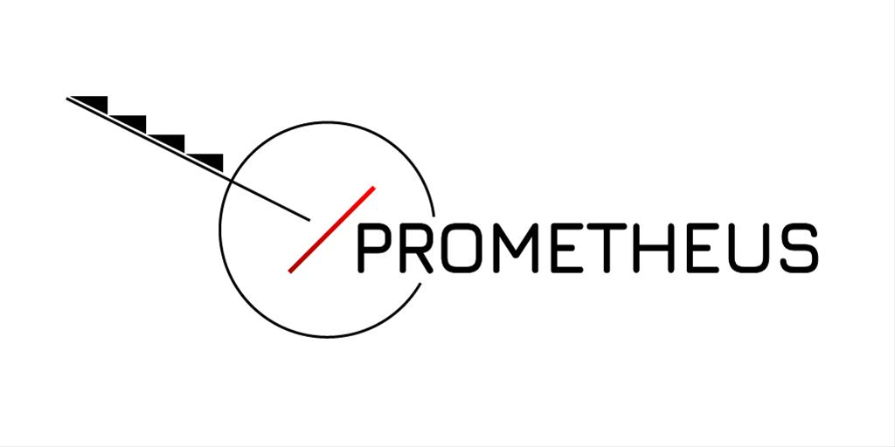

# Cue Sheet and Director suite for project PROMETHEUS

Context-aware Adaptive 3D Projection based on Motion and Activity Estimation for the Immersive and Interactive Experience of Ancient Drama Performances.

## Project Description

Ancient drama is both a national cultural treasure and an important core of contemporary artistic creation both in Greece and abroad. However, the study of ancient drama at the level of performance and, in particular, with regard to the function of the Aristotelian 'view' (scenery, costumes, scenic objects, machines of ancient drama) and the structural-functional elements of the action (interaction with the audience, the role of the dance, the function of the god machine, etc.) does not appear to be equally developed. The main objective of the project is developed in three parallel axes that converge towards the revival of important performances of ancient drama, with an educational and experiential character, in a live performance and in a workshop that can be visited, in a specially designed space NTNG:

- Preservation of historical performances by developing a digital library of 3D objects,
- Development of innovative technological tools for artistic creators and the actor that facilitate the creation of mixed interactive immersion spaces using innovative computer vision and 3d live projection technology on moving objects; and
- Development of interactive user interfaces for real-time audience participation in the evolution of the performance and understanding of individual elements of the performance.

To achieve these objectives, the project will develop an integrated system of innovative computer vision and 3D projection technology, which will allow artistic creators to incorporate elements of old ancient drama performances into new performances and actors and spectators to experience new experiences through immersion in an augmented reality environment.

## Repository Description

This repository implements the Cue Sheet and Director suite for project PROMETHEUS. The Cue Sheet is a tool for the creation of a timeline of events that will be used to control the projection of 3D objects on the stage. The Director suite is used before the play, in order to determine the position of objects, the order of the presented events and whether an event requires viewer interaction, in the form of a vote.

## Installation Requirements

Python version 3.8
pip install paho-mqtt  
pip install zmq

Unity 3D version 2021.9.9f1